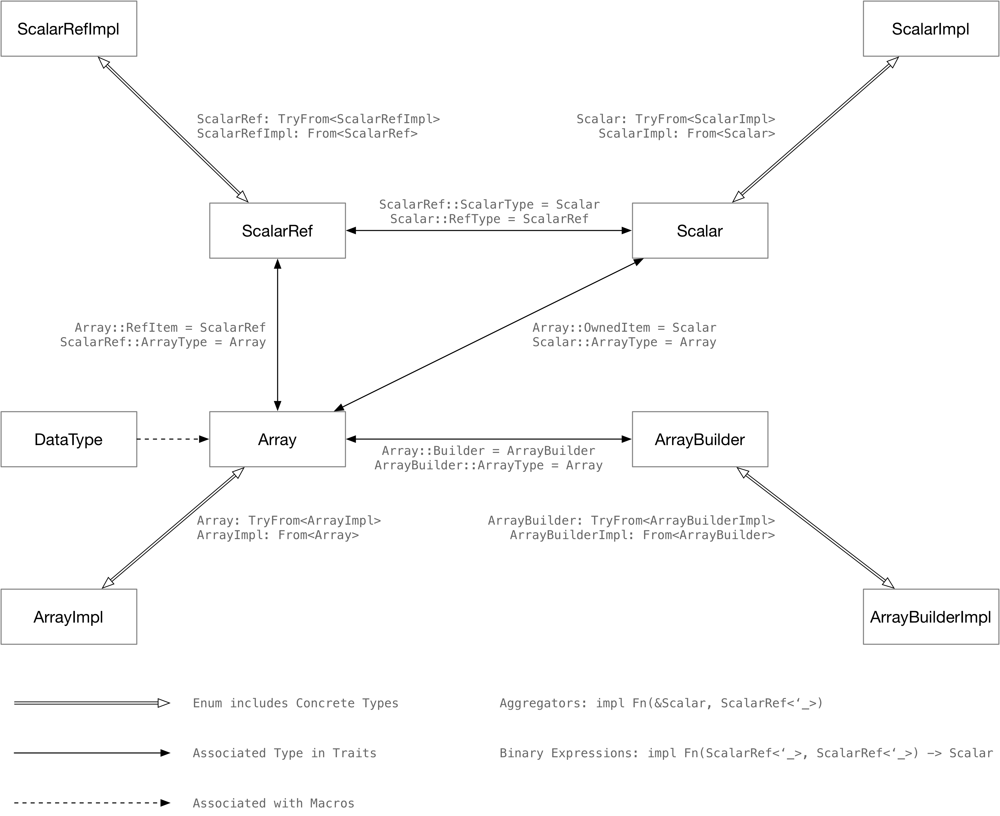

# Type Exercise in Rust

*(In Chinese) 数据库表达式执行的黑魔法：用 Rust 做类型体操*

This is a short lecture on how to use the Rust type system to build necessary components in a database system.

See also... [](https://github.com/risinglightdb/risinglight)

Note that most of the techniques described in this lecture have already been implemented in our educational database system [RisingLight](https://github.com/risinglightdb/risinglight). You may compile and run it by yourself!

The lecture evolves around how Rust programmers (like me) build database systems in the Rust programming language. We leverage the Rust type system to **minimize** runtime cost and make our development process easier with **safe**, **nightly** Rust.



## Deep Dive Type Exercise Series (in Chinese)

On My Blog:
* [Part 0 - Part 2](https://www.skyzh.dev/posts/articles/2022-01-22-rust-type-exercise-in-database-executors/)

On Zhihu:
* [Part 0: Intro](https://zhuanlan.zhihu.com/p/460702914)
* [Part 1: Array and ArrayBuilder](https://zhuanlan.zhihu.com/p/460977012)
* [Part 2: Scalar and ScalarRef](https://zhuanlan.zhihu.com/p/461405621)

## Day 1: `Array` and `ArrayBuilder`

`ArrayBuilder` and `Array` are reciprocal traits. `ArrayBuilder` creates an `Array`, while we can create a new array
using `ArrayBuilder` with existing `Array`. In day 1, we implement arrays for primitive types (like `i32`, `f32`)
and for variable-length types (like `String`). We use associated types in traits to deduce the right type in generic
functions and use GAT to unify the `Array` interfaces for both fixed-length and variable-length types. This framework
is also very similar to libraries like Apache Arrow, but with much stronger type constraints and much lower runtime
overhead.

The special thing is that, we use blanket implementation for `i32` and `f32` arrays -- `PrimitiveArray<T>`. This would
make our journey much more challenging, as we need to carefully evaluate the trait bounds needed for them in the
following days.

### Goals

Developers can create generic functions over all types of arrays -- no matter fixed-length primitive array like
`I32Array`, or variable-length array like `StringArray`.

Without our `Array` trait, developers might to implement...

```rust
fn build_i32_array_from_vec(items: &[Option<i32>]) -> Vec<i32> { /* .. */ }
fn build_str_array_from_vec(items: &[Option<&str>]) -> Vec<String> { /* .. */ }
```

Note that the function takes different parameter -- one `i32` without lifetime, one `&str`. Our `Array` trait
can unify their behavior:

```rust
fn build_array_from_vec<A: Array>(items: &[Option<A::RefItem<'_>>]) -> A {
    let mut builder = A::Builder::with_capacity(items.len());
    for item in items {
        builder.push(*item);
    }
    builder.finish()
}

#[test]
fn test_build_int32_array() {
    let data = vec![Some(1), Some(2), Some(3), None, Some(5)];
    let array = build_array_from_vec::<I32Array>(&data[..]);
}

#[test]
fn test_build_string_array() {
    let data = vec![Some("1"), Some("2"), Some("3"), None, Some("5"), Some("")];
    let array = build_array_from_vec::<StringArray>(&data[..]);
}
```

Also, we will be able to implement an `ArrayIterator` for all types of `Array`s.

## Day 2: `Scalar` and `ScalarRef`

`Scalar` and `ScalarRef` are reciprocal types. We can get a reference `ScalarRef` of a `Scalar`, and convert
`ScalarRef` back to `Scalar`. By adding these two traits, we can write more generic functions with zero runtime
overhead on type matching and conversion. Meanwhile, we associate `Scalar` with `Array`, so as to write functions
more easily.

### Goals

Without our `Scalar` implement, there could be problems:

```rust
fn build_array_repeated_owned<A: Array>(item: A::OwnedItem, len: usize) -> A {
    let mut builder = A::Builder::with_capacity(len);
    for _ in 0..len {
        builder.push(Some(item /* How to convert `item` to `RefItem`? */));
    }
    builder.finish()
}
```

With `Scalar` trait and corresponding implements,

```rust
fn build_array_repeated_owned<A: Array>(item: A::OwnedItem, len: usize) -> A {
    let mut builder = A::Builder::with_capacity(len);
    for _ in 0..len {
        builder.push(Some(item.as_scalar_ref())); // Now we have `as_scalar_ref` on `Scalar`!
    }
    builder.finish()
}
```

## Day 3: `ArrayImpl`, `ArrayBuilderImpl`, `ScalarImpl` and `ScalarRefImpl`

It could be possible that some information is not available until runtime. Therefore, we use `XXXImpl` enums to
cover all variants of a single type. At the same time, we also add `TryFrom<ArrayImpl>` and `Into<ArrayImpl>`
bound for `Array`.

### Goals

This is hard -- imagine we simply require `TryFrom<ArrayImpl>` and `Into<ArrayImpl>` bound on `Array`:

```rust
pub trait Array:
    Send + Sync + Sized + 'static + TryFrom<ArrayImpl> + Into<ArrayImpl>
```

Compiler will complain:

```
43 | impl<T> Array for PrimitiveArray<T>
   |         ^^^^^ the trait `From<PrimitiveArray<T>>` is not implemented for `array::ArrayImpl`
   |
   = note: required because of the requirements on the impl of `Into<array::ArrayImpl>` for `PrimitiveArray<T>`
```

This is because we use blanket implementation for `PrimitiveArray` to cover all primitive types. In day 3,
we learn how to correctly add bounds to `PrimitiveArray`.

## Day 4: More Types and Methods with Macro

`ArrayImpl` should supports common functions in traits, but `Array` trait doesn't have a unified interface for
all types -- `I32Array` accepts `get(&self, idx: usize) -> Option<i32>` while `StringArray` accepts
`get(&self, idx: usize) -> &str`. We need a `get(&self, idx:usize) -> ScalarRefImpl<'_>` on `ArrayImpl`. Therefore,
we have to write the match arms to dispatch the methods.

Also, we have written so many boilerplate code for `From` and `TryFrom`. We need to eliminate such duplicated code.

As we are having more and more data types, we need to write the same code multiple times within a match arm. In
day 4, we use declarative macros (instead of procedural macros or other kinds of code generator) to generate such
code and avoid writing boilerplate code.

### Goals

Before that, we need to implement every `TryFrom` or `Scalar` by ourselves:

```rust
impl<'a> ScalarRef<'a> for i32 {
    type ArrayType = I32Array;
    type ScalarType = i32;

    fn to_owned_scalar(&self) -> i32 {
        *self
    }
}

// repeat the same code fore i64, f64, ...
```

```rust
impl ArrayImpl {
    /// Get the value at the given index.
    pub fn get(&self, idx: usize) -> Option<ScalarRefImpl<'_>> {
        match self {
            Self::Int32(array) => array.get(idx).map(ScalarRefImpl::Int32),
            Self::Float64(array) => array.get(idx).map(ScalarRefImpl::Float64),
            // ...
            // repeat the types for every functions we added on `Array`
        }
    }
```

With macros, we can easily add more and more types. In day 4, we will support:

```rust
pub enum ArrayImpl {
    Int16(I16Array),
    Int32(I32Array),
    Int64(I64Array),
    Float32(F32Array),
    Float64(F64Array),
    Bool(BoolArray),
    String(StringArray),
}
```

With little code changed and eliminating boilerplate code.

## Day 5: Binary Expressions

Now that we have `Array`, `ArrayBuilder`, `Scalar` and `ScalarRef`, we can convert every function we wrote to a
vectorized one using generics.

### Goals

Developers will only need to implement:

```rust
pub fn str_contains(i1: &str, i2: &str) -> bool {
    i1.contains(i2)
}
```

And they can create `BinaryExpression` around this function with any type:

```rust
// Vectorize `str_contains` to accept an array instead of a single value.
let expr = BinaryExpression::<StringArray, StringArray, BoolArray, _>::new(str_contains);
// We only need to pass `ArrayImpl` to the expression, and it will do everything for us,
// including type checks, loopping, etc.
let result = expr
    .eval(
        &StringArray::from_slice(&[Some("000"), Some("111"), None]).into(),
        &StringArray::from_slice(&[Some("0"), Some("0"), None]).into(),
    )
    .unwrap();
```

Developers can even create `BinaryExpression` around generic functions:

```rust
pub fn cmp_le<'a, I1: Array, I2: Array, C: Array + 'static>(
    i1: I1::RefItem<'a>,
    i2: I2::RefItem<'a>,
) -> bool
where
    I1::RefItem<'a>: Into<C::RefItem<'a>>,
    I2::RefItem<'a>: Into<C::RefItem<'a>>,
    C::RefItem<'a>: PartialOrd,
{
    i1.into().partial_cmp(&i2.into()).unwrap() == Ordering::Less
}
```


```rust
// Vectorize `cmp_le` to accept an array instead of a single value.
let expr = BinaryExpression::<I32Array, I32Array, BoolArray, _>::new(
        cmp_le::<I32Array, I32Array, I64Array>,
    );
let result: ArrayImpl = expr.eval(ArrayImpl, ArrayImpl).unwrap();

// `cmp_le` can also be used on `&str`.
let expr = BinaryExpression::<StringArray, StringArray, BoolArray, _>::new(
        cmp_le::<StringArray, StringArray, StringArray>,
    );
let result: ArrayImpl = expr.eval(ArrayImpl, ArrayImpl).unwrap();
```

## Day 6: Erase Expression Lifetime

Vectorization looks fancy in the implementation in day 5, but there is a critical flaw -- `BinaryExpression`
can only process `&'a ArrayImpl` instead of for any lifetime.

```rust
impl<'a, I1: Array, I2: Array, O: Array, F> BinaryExpression<I1, I2, O, F> {
    pub fn eval(&self, i1: &'a ArrayImpl, i2: &'a ArrayImpl) -> Result<ArrayImpl> {
        // ...
    }
}
```

In day 6, we erase the expression lifetime by defining a `BinaryExprFunc` trait and implements it for all expression
functions. The `BinaryExpression` will be implemented as follows:

```rust
impl<I1: Array, I2: Array, O: Array, F> BinaryExpression<I1, I2, O, F> {
    pub fn eval(&self, i1: &ArrayImpl, i2: &ArrayImpl) -> Result<ArrayImpl> {
        // ...
    }
}
```

And there will be an `Expression` trait which can be made into a trait object:

```rust
pub trait Expression {
    /// Evaluate an expression with run-time number of [`ArrayImpl`]s.
    fn eval_expr(&self, data: &[&ArrayImpl]) -> Result<ArrayImpl>;
}
```

In this day, we have two solutions -- the hard way and the easy way.

### Goals -- The Easy Way

If we make each scalar function into a struct, things will be a lot easier.

Developers will now implement scalar function as follows:

```rust
pub struct ExprStrContains;

impl BinaryExprFunc<StringArray, StringArray, BoolArray> for ExprStrContains {
    fn eval(&self, i1: &str, i2: &str) -> bool {
        i1.contains(i2)
    }
}
```

And now we can have an expression trait over all expression, with all type and lifetime erased:

```rust
pub trait Expression {
    /// Evaluate an expression with run-time number of [`ArrayImpl`]s.
    fn eval_expr(&self, data: &[&ArrayImpl]) -> Result<ArrayImpl>;
}
```

`Expression` can be made into a `Box<dyn Expression>`, therefore being used in building expressions at runtime.

### Goals -- The Hard Way

In the hard way chapter, we will dive into the black magics and fight against (probably) compiler bugs, so as
to make function vectorization look very approachable to SQL function developers.

To begin with, we will change the signature of `BinaryExpression` to take `Scalar` as parameter:

```rust
pub struct BinaryExpression<I1: Scalar, I2: Scalar, O: Scalar, F> {
    func: F,
    _phantom: PhantomData<(I1, I2, O)>,
}
```

Then we will do a lot of black magics on `Scalar` type, so as to do the conversion freely between `Array::RefItem`
and `Scalar::RefType`. This will help us bypass most of the issues in GAT, and yields the following vectorization
code:

```rust
builder.push(Some(O::cast_s_to_a(
    self.func
        .eval(I1::cast_a_to_s(i1), I2::cast_a_to_s(i2))
        .as_scalar_ref(),
)))
```

We will construct a bridge trait `BinaryExprFunc` between plain functions and the one that can be used by
`BinaryExpression`.

And finally developers can simply write a function and supply it to `BinaryExpression`.

```rust
let expr = BinaryExpression::<String, String, bool, _>::new(str_contains);
```

... or even with lambda functions:

```rust
let expr = BinaryExpression::<String, String, bool, _>::new(|x1: &str, x2: &str| x1.contains(x2));
```

## Day 7: Physical Data Type and Logical Data Type

`i32`, `i64` is simply physical types -- how types are stored in memory (or on disk). But in a database system,
we also have logical types (like `Char`, and `Varchar`). In day 7, we learn how to associate logical types with
physical types using macros.

### Goals

Going back to our `build_binary_expression` function,

```rust
/// Build expression with runtime information.
pub fn build_binary_expression(
    f: ExpressionFunc,
) -> Box<dyn Expression> {
    match f {
        CmpLe => Box::new(BinaryExpression::<I32Array, I32Array, BoolArray, _>::new(
            ExprCmpLe::<_, _, I32Array>(PhantomData),
        )),
    /* ... */
```

Currently, we only support `i32 < i32` for `CmpLe` expression. We should be able to support cross-type comparison here.

```rust
/// Build expression with runtime information.
pub fn build_binary_expression(
    f: ExpressionFunc,
    i1: DataType,
    i2: DataType
) -> Box<dyn Expression> {
    match f {
        CmpLe => match (i1, i2) {
            (SmallInt, SmallInt) => /* I16Array, I16Array */,
            (SmallInt, Real) => /* I16Array, Float32, cast to Float64 before comparison */,
            /* ... */
        }
    /* ... */
```

We have so many combinations of cross-type comparison, and we couldn't write them all by-hand. In day 7, we use
macros to associate logical data type with `Array` traits, and reduce the complexity of writing such functions.

**Goals -- The Easy Way**

```rust
/// Build expression with runtime information.
pub fn build_binary_expression(
    f: ExpressionFunc,
    i1: DataType,
    i2: DataType,
) -> Box<dyn Expression> {
    use ExpressionFunc::*;

    use crate::array::*;
    use crate::expr::cmp::*;
    use crate::expr::string::*;

    match f {
        CmpLe => for_all_cmp_combinations! { impl_cmp_expression_of, i1, i2, ExprCmpLe },
        CmpGe => for_all_cmp_combinations! { impl_cmp_expression_of, i1, i2, ExprCmpGe },
        CmpEq => for_all_cmp_combinations! { impl_cmp_expression_of, i1, i2, ExprCmpEq },
        CmpNe => for_all_cmp_combinations! { impl_cmp_expression_of, i1, i2, ExprCmpNe },
        StrContains => Box::new(
            BinaryExpression::<StringArray, StringArray, BoolArray, _>::new(ExprStrContains),
        ),
    }
}
```

**Goals -- The Hard Way**

```rust
/// Build expression with runtime information.
pub fn build_binary_expression(
    f: ExpressionFunc,
    i1: DataType,
    i2: DataType,
) -> Box<dyn Expression> {
    use ExpressionFunc::*;

    use crate::expr::cmp::*;
    use crate::expr::string::*;

    match f {
        CmpLe => for_all_cmp_combinations! { impl_cmp_expression_of, i1, i2, cmp_le },
        CmpGe => for_all_cmp_combinations! { impl_cmp_expression_of, i1, i2, cmp_ge },
        CmpEq => for_all_cmp_combinations! { impl_cmp_expression_of, i1, i2, cmp_eq },
        CmpNe => for_all_cmp_combinations! { impl_cmp_expression_of, i1, i2, cmp_ne },
        StrContains => Box::new(BinaryExpression::<String, String, bool, _>::new(
            str_contains,
        )),
    }
}
```

The goal is to write as less code as possible to generate all combinations of comparison.

## Day 8: List Type

In Apache Arrow, we have `ListArray`, which is equivalent to `Vec<Option<Vec<Option<T>>>>`. We implement this in
day 8.

```rust
let mut builder = ListArrayBuilder::with_capacity(0);
builder.push(Some((&/* Some ArrayImpl */).into()));
builder.push(Some((&/* Some ArrayImpl */).into()));
builder.push(None);
builder.finish();
```

# TBD Lectures

## Day 9: Boxed Array

Use `Box<dyn Array>` instead of `ArrayImpl` enum.

## Day 10: Aggregators

Aggregators are another kind of expressions. We learn how to implement them easily with our type system in day 10.

## Day 11: Expression Framework

Now we are having more and more expression kinds, and we need an expression framework to unify them -- including
unary, binary and expressions of more inputs.

At the same time, we will also experiment with return value optimizations in variable-size types.
