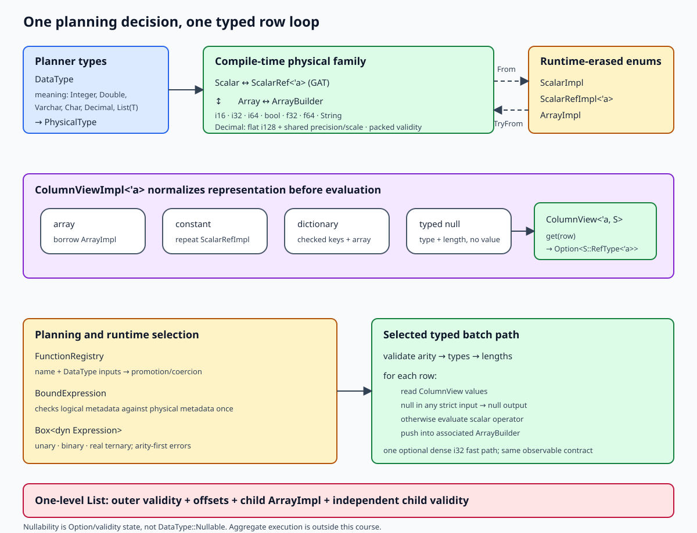

{{#include wip-banner.md}}

# Build a Typed Database Expression Engine in Rust

A hand-written loop for `i32 + i32` is easy:

```rust,ignore
for row in 0..left.len() {
    output.push(match (left.get(row), right.get(row)) {
        (Some(left), Some(right)) => Some(
            std::ops::Add::add(std::num::Wrapping(left), std::num::Wrapping(right)).0,
        ),
        _ => None,
    });
}
```

The design problem appears when the engine must also borrow strings without copying, read
constants and Indexed views, promote mixed numeric types, reject bad arity and lengths, and choose
a function from runtime names. Repeating those decisions in every loop makes each new function a
new place for type drift, null bugs, and inconsistent errors.

This course builds the connections that move those decisions out of the row loop. The workspace
starts with two crates: `type-exercise-starter-core` owns storage, views, and reusable evaluators;
`type-exercise-starter-expr` depends on it and owns concrete operations and binding. You will first
write the small cases by hand. Once their duplication is visible, generic unary, binary, and
ternary auto-vectorizers let a new expression author supply only one scalar operation.



The map has four reading directions:

1. `DataType` tells the planner what a value means; `PhysicalType` selects storage.
2. `Scalar`, `ScalarRef`, `Array`, and `ArrayBuilder` form one compile-time family, while erased
   enums cross runtime boundaries through checked conversions.
3. `ColumnViewImpl` normalizes array, constant, Indexed, and typed-null representations before one
   selected typed expression enters its row loop.
4. The facade depends on core, but core never depends on a concrete arithmetic, Boolean, or string
   operation. That one-way edge keeps the reusable loop independent of the function catalog.

The numeric chapters keep scalar hooks statically typed, auto-vectorize them through monomorphized
generic helpers, and erase only whole-batch adapters.
For signed addition, subtraction, and multiplication, `std::num::Wrapping<T>` makes the chosen
cross-profile overflow behavior explicit while still using the standard operator traits.

Nullability is value state—`Option` or validity—not a `DataType::Nullable` variant. A one-level
List adds offsets and independent outer/child validity; it does not add an aggregate engine.

## What you need to know

You should be comfortable with Rust enums, traits, references, `Option`, and ordinary Cargo use.
The course introduces generic associated types, checked runtime erasure, typestate, and
return-position `impl Trait` in the concrete places that need them.

Each lab begins from the preceding completed snapshot, names the learner-owned change, and gives an
exact command for useful feedback. Passing the supplied test is necessary; you should also be able
to explain why the new boundary exists and which failure it prevents.

The ten cumulative checkpoints form seven teaching days:

1. **Physical type families** (Chapter 1) connects owned and borrowed scalars, arrays, builders,
   logical types, and checked erased values.
2. **Lazy column views** (Chapter 2) normalizes Array, Constant, typed-null, and Indexed inputs.
3. **Shared typed evaluation** (Chapter 3) lifts unary, binary, and ternary scalar operations over
   complete batches.
4. **Variable-width publication and common shapes** (Chapters 4–5) publishes string rows
   transactionally and specializes useful Array and Constant combinations.
5. **Exceptional semantics and batch erasure** (Chapters 6–7) isolates a raw Int32 lane, keeps
   fallible and nullable semantics visible, and erases only the complete batch.
6. **Logical binding and one-level Lists** (Chapters 8–9) selects physical factories once and
   extends the storage model without recursive nesting.
7. **Thread-safe async evaluation** (Chapter 10) makes the registry shareable and wraps one batch
   in a future without introducing per-row async work.

Plan about 18–24 focused hours in total: two to three hours for a single-chapter day and three to
four hours for a paired day. Newer Rust learners should expect to take longer.

Continue to [Environment Setup](./setup.md).

{{#include copyright.md}}
